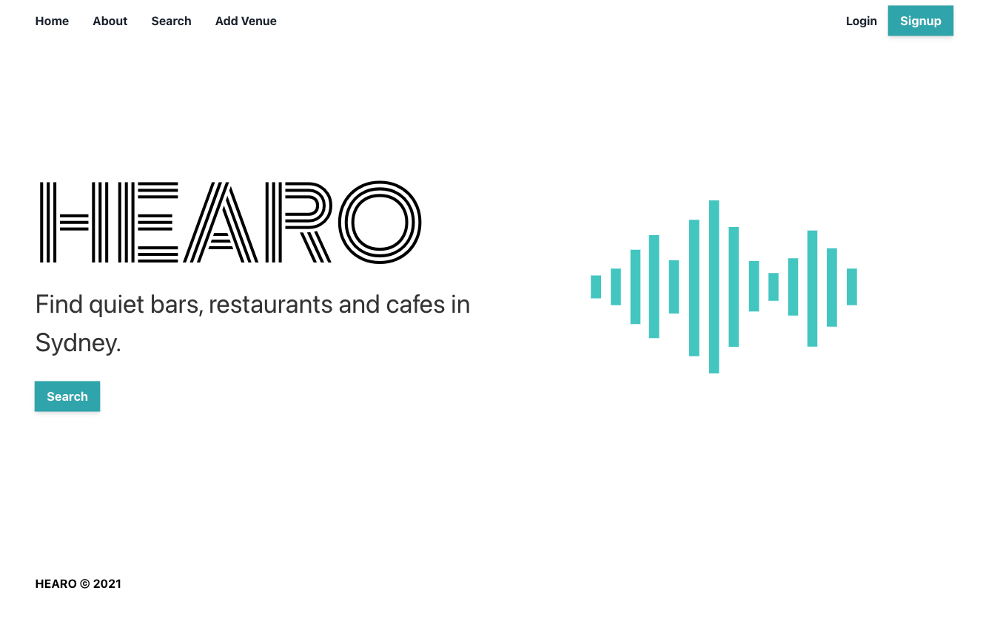

# HEARO: find quiet places to socialise in Sydney

## What?

Find quiet places to socialise in Sydney. An app that lets you search for quiet places and review places for their loudness.

## Table of Contents

- [Installation](#installation)
- [User Story](#user-story)
- [Technologies used](#tech)
- [Screenshot](#screenshot)
- [Links to deployed app](#link)
- [License](#license)
- [Questions and how to contribute](#contact)

## Installation

npm install + npm run develop

## Link

Link to deployed app is [here](https://mern-deploy-o7jn.onrender.com/)

## Tech

MERN stack with a React front end, MongoDB database, and Node.js/Express.js server and API. Built using the Chakra UI framework, GraphQL and Google Places Autocomplete API.

## User Story

When I open the app I can search for a place. When I search I am presented with a number of options. If I want to review a place I must login. When I login I can go to my profile page and make an entry.

## Screenshot

## License

## Contact

Michelle Watts
watts.e.michelle@gmail.com
